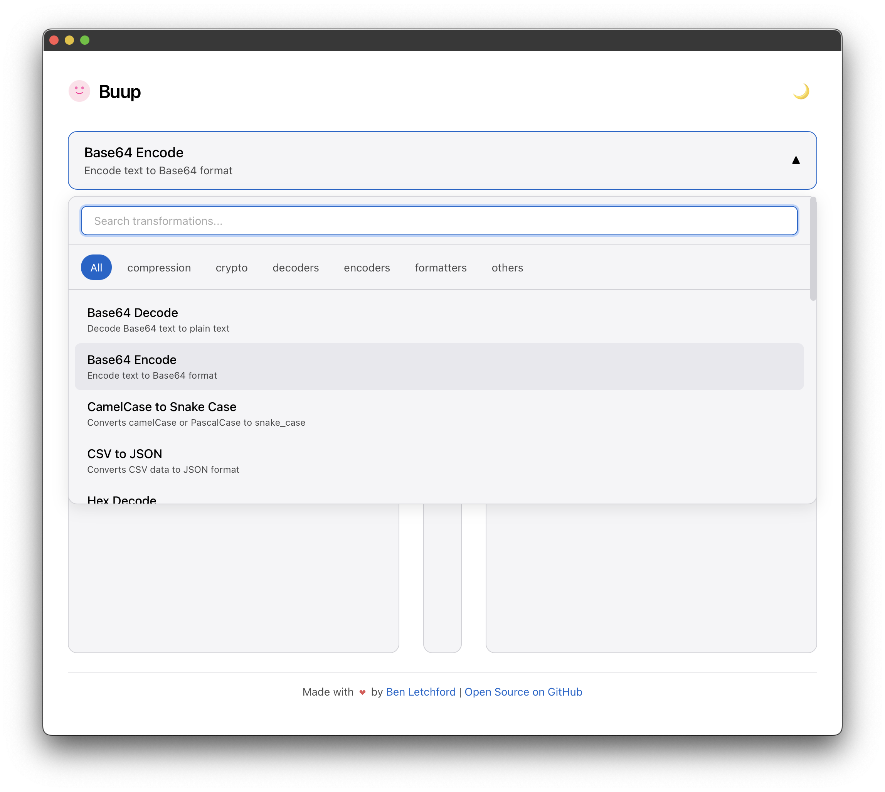

# Buup - The Text Utility Belt

Buup is a versatile text transformation toolkit that provides a dependency-free core library and CLI for common text manipulations like encoding/decoding, formatting, cryptography, (coming soon compression/decompression), and more written in pure dependency-free Rust.

It is designed to be a simple, lightweight, **open**, **secure**, **provably fast** and easy to integrate.

Drop-in replacement for all of those dodgy online text transformation tools you've ever used in the past except the batteries are included (and they are all in pure Rust).

It includes a [web application](https://buup.io) which is of course written in pure Rust (WASM via [Dioxus](https://dioxuslabs.com/)) as a separate workspace member.

<div align="center">
    <a href="https://buup.io">
        
    </a>
</div>

## Key Features

- **Zero Dependencies**: The core `buup` library and its CLI implement all transformations without external dependencies
- **Multiple Interfaces**: CLI for terminal workflows and Web UI for interactive use
- **Extensible Design**: Easy to add new transformers by implementing the `Transform` trait
- **Strong Typing**: Full type safety with comprehensive error handling
- **Thread Safety**: All transformers are designed to be safely used concurrently
- **Performance**: Optimized for speed and memory usage

## Ways to Use Buup

Buup offers three distinct ways to transform your text:

### 1. Web Application

A modern, responsive web application for interactive text transformations proudly built with [Dioxus](https://dioxuslabs.com/).

|                            Dark Mode                            |                            Light Mode                            |
| :-------------------------------------------------------------: | :--------------------------------------------------------------: |
|  |  |

From source:

```bash
# Serve the web UI (requires Dioxus CLI)
cd buup_web
dx serve
```

Build for production:

```bash
dx build
```

### 2. Command Line Interface

Zero-dependency CLI for quick transformations in your terminal workflows.

```bash
# Installation
cargo binstall buup # or cargo install buup

# List available transformers
buup list

# Examples
buup base64encode "Hello, world!"     # Encode text directly
buup urldecode -i encoded.txt         # Decode from file
echo "Hello" | buup hexencode         # Pipe from stdin
```

### 3. Rust Library

Integrate Buup's transformers directly into your Rust applications.

```bash
# Add to your project
cargo add buup
```

```rust
use buup::{transformer_from_id, Transform, Base64Encode};

// Option 1: Use a specific transformer struct
let encoded = Base64Encode.transform("Hello, Library!").unwrap();
println!("{}", encoded); // SGVsbG8sIExpYnJhcnkh

// Option 2: Look up a transformer by its ID
let transformer = transformer_from_id("base64decode").unwrap();
let decoded = transformer.transform(&encoded).unwrap();
println!("{}", decoded); // Hello, Library!
```

## Available Transformers

The following transformers are currently available in Buup:

```bash
Available transformers:

ENCODERS:
  ascii_to_hex    - Convert ASCII characters to their hexadecimal representation.
  base64encode    - Encode text to Base64 format
  bin_to_hex      - Convert binary numbers to hexadecimal.
  binaryencode    - Encode text into its binary representation (space-separated bytes).
  dec_to_bin      - Convert decimal numbers to binary.
  dec_to_hex      - Convert decimal numbers to hexadecimal.
  hex_to_bin      - Convert hexadecimal numbers to binary.
  hexencode       - Encode text to hexadecimal representation
  htmlencode      - Encodes special characters to HTML entities
  morseencode     - Encode text to Morse code
  rot13           - Applies the ROT13 substitution cipher to the input text.
  urlencode       - Encode text for use in URLs

DECODERS:
  base64decode    - Decode Base64 text to plain text
  bin_to_dec      - Convert binary numbers to decimal.
  binarydecode    - Decode space-separated binary representation back to text.
  hex_to_ascii    - Convert hexadecimal representation back to ASCII characters.
  hex_to_dec      - Convert hexadecimal numbers to decimal.
  hexdecode       - Decode hexadecimal to original text
  htmldecode      - Decodes HTML entities back to special characters
  jwtdecode       - Decodes a JSON Web Token (JWT) into its header and payload without verifying the signature.
  morsedecode     - Decode Morse code to text
  urldecode       - Decode URL-encoded text

FORMATTERS:
  jsonformatter   - Formats JSON with proper indentation
  jsonminifier    - Minifies JSON by removing whitespace
  linenumberadder - Adds line numbers (1-based) to the beginning of each line.
  linenumberremover - Removes leading line numbers (e.g., '1 ', '2. ', '3:	') from each line.

CRYPTOGRAPHY:
  md5hash         - Computes the MD5 hash of the input text
  sha256hash      - Computes the SHA-256 hash of the input text
  uuid5_generate  - Generates a version 5 UUID based on namespace and name using SHA-1. Input format: "namespace|name". Namespace can be a UUID or one of: dns, url, oid, x500.

OTHERS:
  cameltosnake    - Converts camelCase or PascalCase to snake_case
  csvtojson       - Converts CSV data to JSON format
  jsontocsv       - Converts JSON data to CSV format
  linesorter      - Sorts lines of text alphabetically (ascending).
  slugify         - Converts text into a URL-friendly slug (lowercase, dashes, removes special chars)
  snaketocamel    - Converts snake_case to camelCase
  text_stats      - Calculates basic text statistics (lines, words, chars, sentences)
  textreverse     - Reverses the input text
  uniquelines     - Removes duplicate lines, preserving the order of first occurrence.
  urlparser       - Parses a URL into its components (scheme, authority, path, query, fragment)
  uuid_generate   - Generates a version 4 UUID. Input is ignored. WARNING: Uses a non-cryptographically secure PRNG.
  whitespaceremover - Removes all whitespace (spaces, tabs, newlines) from the input text.

EXAMPLES:
  buup base64encode "Hello, world!"     # Encode text directly
  buup urldecode -i encoded.txt         # Decode from file
  echo "Hello" | buup hexencode         # Pipe from stdin
```

### Update README.md with `buup list`

```bash
cargo run --bin update_readme
```

## Contributing

Contributions are welcome! When adding new transformers or modifying code, please ensure:

1. **Zero external dependencies** in the core `buup` library
2. **Comprehensive tests** covering functionality and edge cases
3. **Clear error handling** using `TransformError`
4. Run `cargo test --workspace` and `cargo clippy --workspace -- -D warnings`

### Creating Custom Transformers

**Basic Structure**

To create a custom transformer:

1. Create a new struct that implements the `Transform` trait
2. Add the struct to the registry in `lib.rs`

**Step 1: Example Implementation**

Here's a simple example of a custom transformer that reverses text:

```rust
use buup::{Transform, TransformError, TransformerCategory};

/// Text Reverse transformer
#[derive(Debug, Clone, Copy, PartialEq, Eq)]
pub struct TextReverse;

impl Transform for TextReverse {
    fn name(&self) -> &'static str {
        "Text Reverse"
    }

    fn id(&self) -> &'static str {
        "textreverse"
    }

    fn category(&self) -> TransformerCategory {
        TransformerCategory::Other
    }

    fn description(&self) -> &'static str {
        "Reverses the input text"
    }

    fn transform(&self, input: &str) -> Result<String, TransformError> {
        Ok(input.chars().rev().collect())
    }
}
```

**Step 2: Add to Registry**

In `lib.rs`, add your transformer to the `register_builtin_transformers` function:

```rust,ignore
fn register_builtin_transformers() -> Registry {
    let mut registry = Registry {
        transformers: HashMap::new(),
    };
    // ... existing registrations ...

    // Import your new transformer struct
    use crate::transformers::my_transformer::MyNewTransformer;

    // Add your new transformer instance
    registry.transformers.insert(MyNewTransformer.id(), &MyNewTransformer);

    registry
}
```

**Step 3: Export Your Transformer (Optional)**

If your transformer will be used directly, add it to the exports in `transformers/mod.rs`:

```rust,ignore
// src/transformers/mod.rs
mod base64_decode;
// ... other mods ...
mod my_transformer; // Your new module

pub use base64_decode::Base64Decode;
// ... other uses ...
pub use my_transformer::MyNewTransformer; // Your new transformer
```

**Step 4: Add Inverse Support (Optional)**

If your transformer has an inverse operation, update the `inverse_transformer` function in `lib.rs`:

```rust,ignore
pub fn inverse_transformer(t: &dyn Transform) -> Option<&'static dyn Transform> {
    match t.id() {
        // ... existing matches ...
        "my_encoder" => transformer_from_id("my_decoder").ok(), // Your transformer pair
        "my_decoder" => transformer_from_id("my_encoder").ok(), // Your transformer pair
        _ => None,
    }
}
```

**Tips for Creating Good Transformers**

1. Follow the naming convention of existing transformers
2. Provide clear and concise descriptions
3. Make sure your transformer is thread-safe (impl Sync+Send)
4. Consider implementing pairs of transformers for inverse operations
5. Add comprehensive tests for your transformer
