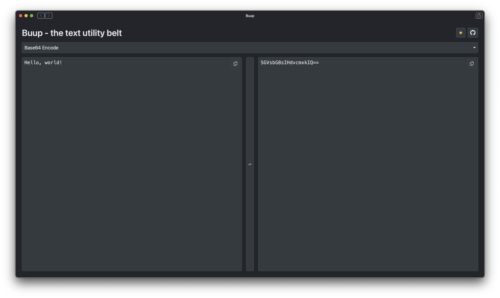

#  Buup - The Text Utility Belt

Buup is a modern web application that tries to do one thing well - it provides a suite of text transformation tools in a clean, user-friendly interface.



## Development

```bash
# Clone the repository
git clone https://github.com/benletchford/buup.git

# Navigate to the project directory
cd buup

# Install dependencies
npm install

# Start the development server
npm run dev

# Build for production
npm run build
```

## Contributing

Contributions are welcome! Feel free to submit a Pull Request.

## License

This project is open source and available under the MIT license.
